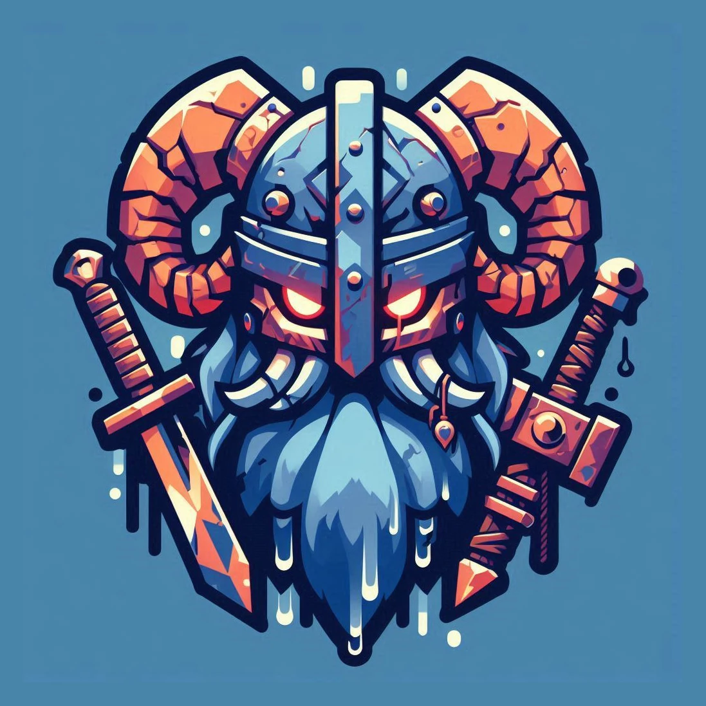

# GG Valheim Server Dashboard

<center>
    <a href="https://ggserver.cc">
        
    </a>
</center>

This repository contains the code and scripts used to monitor and display real-time status and metrics for a dedicated Valheim game server.

The dashboard is hosted at [ggserver.cc](https://ggserver.cc) and provides live updates about server health, player activity, and system resource usage.

## Table of Contents

- [GG Valheim Server Dashboard](#gg-valheim-server-dashboard)
  - [Table of Contents](#table-of-contents)
  - [Project Overview](#project-overview)
  - [Features](#features)
    - [1. Server Status Monitoring](#1-server-status-monitoring)
    - [2. Player Information](#2-player-information)
    - [3. System Resource Metrics](#3-system-resource-metrics)
    - [4. Automatic Data Refresh](#4-automatic-data-refresh)
    - [5. Error Handling](#5-error-handling)
  - [Screenshots](#screenshots)
    - [Current Dashboard](#current-dashboard)
    - [Basic Dashboard (Legacy)](#basic-dashboard-legacy)
  - [Data Sources](#data-sources)
    - [1. status.json](#1-statusjson)
    - [2. player\_data.json](#2-player_datajson)
    - [3. metrics.json](#3-metricsjson)
  - [Infrastructure](#infrastructure)
  - [Technologies Used](#technologies-used)
  - [Setup](#setup)

## Project Overview

The **GG Valheim Server Dashboard** is a web-based interface designed to track the status of a Valheim game server, including player activity and server resource consumption. It leverages real-time data to ensure players and server admins can stay informed about the server's health and performance.

## Features

### 1. Server Status Monitoring

- Displays key server details, including:
  - **Server Name**
  - **Player Count**
  - **Password Protection Status**
  - **Steam ID**
  - **Port**
- Shows error messages if the server is not responding or still starting up.
- Data is sourced from the `status.json` file, which is automatically generated by the [Valheim Server Docker Image](https://github.com/lloesche/valheim-server-docker) (more details in the [Status Web Server documentation](https://github.com/lloesche/valheim-server-docker?tab=readme-ov-file#status-web-server)).

### 2. Player Information

- Displays details about currently connected players, including:
  - **Player Names**
  - **Connection Times (localized)**
  - **Session Durations**
  - **Death Count**
- Player data is fetched from the `player_data.json` file, which is generated by a custom Python script that parses server logs.

### 3. System Resource Metrics

- Provides real-time charts for:
  - **CPU Usage** (per core)
  - **Disk Usage**
  - **Memory Usage**
- Metrics are sourced from the `metrics.json` file, updated every minute by a Python script triggered via a systemd timer.

### 4. Automatic Data Refresh

- The dashboard automatically refreshes every 10 seconds, ensuring the displayed data is always up-to-date.

### 5. Error Handling

- When the required JSON files (`status.json`, `player_data.json`, `metrics.json`) are unavailable or inaccessible, the system gracefully handles the error by showing appropriate fallback messages or using placeholder data (with a red background). This ensures the dashboard remains functional and informative, even in case of server issues.

## Screenshots

### Current Dashboard


### Basic Dashboard (Legacy)


## Data Sources

### 1. status.json

The `status.json` file is generated by the [lloesche/Valheim Server Docker Image](https://github.com/lloesche/valheim-server-docker) when the `STATUS_HTTP=true` environment variable is set. 

The file is updated every 10 seconds and contains key details about the server's current status.

- Example of `status.json` content:

```json
{
  "last_status_update": "2021-03-07T21:42:16.076662+00:00",
  "server_name": "My Docker based server",
  "player_count": 1,
  "password_protected": true,
  "port": 2456,
  "steam_id": 90143789459088380,
  "players": [
    {
      "name": "",
      "duration": 7.000421047210693
    }
  ]
}
```

This file is publicly accessible and served via a web server running on the Docker container, which is configured to run on `port 80` by default. 

More details are available in the [lloesche Status Web Server documentation](https://github.com/lloesche/valheim-server-docker?tab=readme-ov-file#status-web-server).

### 2. player_data.json

This file is dynamically generated by a Python script that parses the server logs inside the Docker container. The script runs as a systemd service on the Azure VM.

- Example of `player_data.json`:

```json
{
  "Player1": {
    "connection_time": "2024-09-29T12:34:56Z",
    "death_count": 2
  }
}
```

### 3. metrics.json

The `metrics.json` file is created by a Python script running via a systemd timer on the VM. It contains resource usage data such as CPU, memory, and disk usage, updated every minute.

- Example of `metrics.json`:

```json
{
  "cpu": {
    "per_core_percent": [15, 25, 30]
  },
  "disk": {
    "disk_1": {
      "percent": 50,
      "used_bytes": 5000000000,
      "total_bytes": 10000000000
    }
  },
  "memory": {
    "total_bytes": 16000000000,
    "used_bytes": 8000000000
  }
}
```

## Infrastructure

- **Server**: The dedicated Valheim server is hosted on an **Azure VM** running **Linux** (Ubuntu). The Docker container for the Valheim server is based on the [lloesche/valheim-server-docker](https://github.com/lloesche/valheim-server-docker) image.
- **Domain**: The domain [ggserver.cc](https://ggserver.cc) is managed and proxied via **Cloudflare**.
- **Python Scripts**:
  - One script monitors and parses the logs from the Docker container to generate `player_data.json`.
  - Another script collects system metrics (CPU, memory, disk) and generates `metrics.json`.

## Technologies Used

- **Frontend**:
  - **HTML/CSS/JavaScript** for the user interface.
  - [**Chart.js**](https://www.chartjs.org/) and [**Chart.js DataLabels Plugin**](https://chartjs-plugin-datalabels.netlify.app/) for visualizing CPU, memory, and disk metrics.
  
- **Backend**:
  - **Python** scripts for log parsing and system metric collection.
  - **Docker** container running the Valheim server.
  
- **Hosting**:
  - **Azure VM** for server hosting.
  - **Cloudflare** for domain management and proxying.

## Setup

To set up a similar Valheim server dashboard, follow these steps:

1. Clone or pull the [Valheim Docker Image](https://github.com/lloesche/valheim-server-docker) and configure it with `STATUS_HTTP=true` to enable the status web server.
2. Set up the necessary Python scripts to:
   - Parse Valheim server logs and generate `player_data.json`.
   - Collect system metrics and generate `metrics.json`.
3. Host the dashboard using a web server such as [Caddy](https://caddyserver.com/), [Nginx](https://nginx.org/en/) or [Apache](https://httpd.apache.org/).
